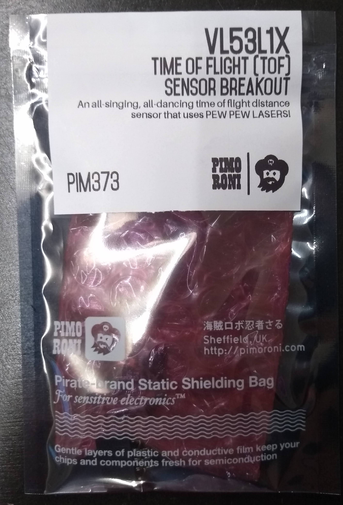
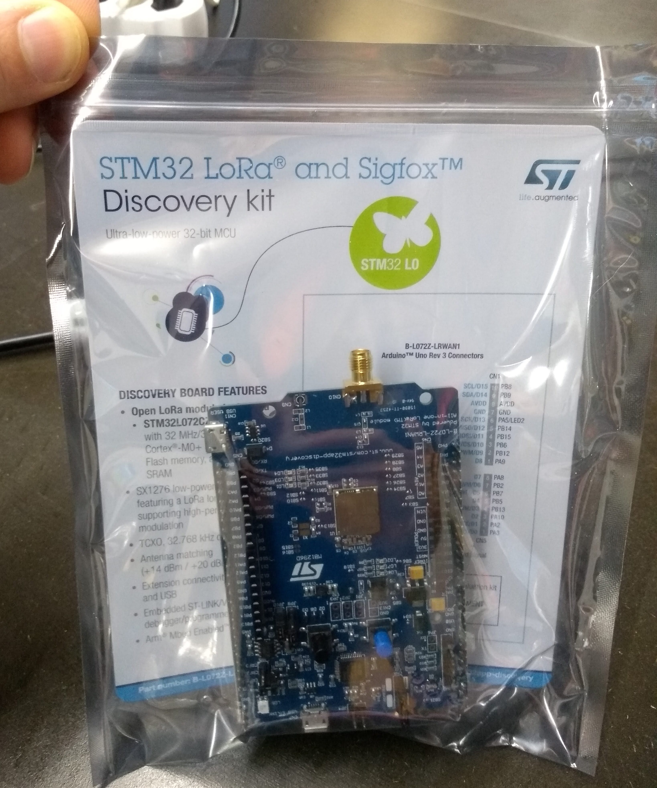

# What's in the box!

## Sensors

### Environmental sensor

More info on [Sensiron website](https://developer.sensirion.com/platforms/environmental-sensor-shield/).

### Sonar - HC-SR04

More info on [Random Nerd Tutorials](https://randomnerdtutorials.com/complete-guide-for-ultrasonic-sensor-hc-sr04/).

### Motion sensor

More info on [Seeed Studio](https://www.seeedstudio.com/PIR-Motion-Sensor-Large-Lens-version.html).

### Time of flight - VL53L1X

More info on [Pimoroni](https://shop.pimoroni.com/products/vl53l1x-breakout).

### UV Sensor

More info on [Adafruit](https://www.adafruit.com/product/2899).

### Thermal Camera Breakout

More info on [Adafruit](https://www.adafruit.com/product/3538).

## Modem
### Discovery board - STM32

More info on [ST website](https://www.st.com/content/st_com/en/products/evaluation-tools/product-evaluation-tools/mcu-mpu-eval-tools/stm32-mcu-mpu-eval-tools/stm32-discovery-kits/b-l072z-lrwan1.html).

### SL E234156

